# 🌊 OceanEye

> **Autonomous Maritime Oil Spill Detection, Lagrangian Drift Modeling & Vessel Attribution Platform**

OceanEye is an end-to-end maritime intelligence and environmental enforcement platform. It fuses **Sentinel-1 Synthetic Aperture Radar (SAR)** satellite imagery, **Copernicus Marine (CMEMS)** ocean currents and wind fields, **Automatic Identification System (AIS)** vessel tracking data, and **machine learning models** to autonomously detect marine oil slicks, model their past and future trajectory, and mathematically attribute responsibility to culprit vessels.

---

## 📑 Table of Contents

- [The Problem & Solution](#-the-problem--the-solution)
- [System Architecture](#-system-architecture)
- [Key Features](#-key-features)
- [Tech Stack & Technologies Used](#-tech-stack--technologies-used)
- [Directory Structure](#-directory-structure)
- [Pipeline Phases in Detail](#-pipeline-phases-in-detail)
  - [Phase 1: Multi-Source Data Ingestion](#phase-1-multi-source-data-ingestion)
  - [Phase 2: Data Processing & Normalization](#phase-2-data-processing--normalization)
  - [Phase 3: AI/ML Detection & Ranking Suite](#phase-3-aiml-detection--ranking-suite)
  - [Phase 4: Lagrangian Drift & Attribution Engine](#phase-4-lagrangian-drift--attribution-engine)
  - [Phase 5: FastAPI Backend & GeoJSON Services](#phase-5-fastapi-backend--geojson-services)
  - [Phase 6: Interactive Command & Evidence Dashboard](#phase-6-interactive-command--evidence-dashboard)
- [Getting Started & Installation](#-getting-started--installation)
  - [Prerequisites](#prerequisites)
  - [Backend Setup](#1-backend-setup)
  - [Frontend Setup](#2-frontend-setup)
- [API Reference](#-api-reference)
- [Operational & Legal Notice](#-operational--legal-notice)
- [License](#-license)

---

## 🎯 The Problem & The Solution

### The Challenge
Illegal marine oil discharges—such as clandestine bilge water dumps, tank washings, and unreported bunker leaks—account for over **80% of marine oil pollution**, significantly exceeding catastrophic tanker accidents. Under cover of darkness or in remote international waters, rogue vessels dump oil with near impunity because:
1. **Traditional surveillance is intermittent**: Aircraft patrols and coast guard cutters are costly and have limited coverage.
2. **Oil slicks drift rapidly**: Currents and winds displace and disperse slicks by tens of nautical miles within hours.
3. **AIS transponders are intentionally manipulated**: Vessels often shut down transponders (AIS gaps) or alter speed during illicit operations.
4. **Natural look-alikes confuse sensors**: Low-wind sea surfaces, biogenic films, and internal waves mimic the low radar backscatter of mineral oil slicks.

### The OceanEye Solution
OceanEye automates the complete investigative loop for maritime authorities, environmental agencies, and coast guards:
- **Satellite Detection**: Ingests Sentinel-1 C-band SAR imagery capable of penetrating clouds and darkness.
- **AI Classification**: Filters out natural look-alikes using deep learning (PyTorch U-Net) and gradient-boosted trees (XGBoost).
- **Physics-Based Back-Tracing**: Runs backward Lagrangian particle tracking incorporating CMEMS surface currents and wind leeway to determine the precise spatio-temporal origin of the discharge.
- **Vessel Attribution**: Intersects vessel AIS trajectories with the origin zone, scoring candidates on kinematic anomalies (AIS silence duration, sudden speed reductions, closest point of approach).
- **Actionable Evidence Dossier**: Generates forensic PDF reports and an interactive GIS dashboard ready for maritime inspection and legal action.

---

## 🏗️ System Architecture

```mermaid
flowchart TD
    subgraph DataIngestion ["1. Data Ingestion"]
        S1["Sentinel-1 SAR (CDSE OData)"]
        CM_CUR["CMEMS Surface Currents"]
        CM_WIND["CMEMS 10m Wind Vectors"]
        AIS["AIS Tracking (AISHub / MT)"]
    end

    subgraph Processing ["2. Normalization & Preprocessing"]
        P_SAR["SAR Decibel Conversion & Filtering"]
        P_OCEAN["Current & Wind Grid Interpolation"]
        P_AIS["AIS Trajectory Reconstruction"]
    end

    subgraph AI_Engine ["3. AI / ML Detection Suite"]
        UNET["PyTorch U-Net (Slick Candidate Segmentation)"]
        XGB_LOOK["XGBoost Look-Alike Classifier"]
        XGB_RANK["XGBoost Vessel Prioritization Ranker"]
    end

    subgraph Physics ["4. Lagrangian Transport Engine"]
        FWD["Forward Drift Simulation (+24h to +72h)"]
        BWD["Backward Drift Simulation (-48h Origin)"]
        MC["Monte Carlo Particle Dispersion Hull"]
    end

    subgraph Backend ["5. FastAPI Service & API"]
        FASTAPI["FastAPI REST & GeoJSON Engine"]
        ROUTES["Events | Spills | Vessels | Suspects | Drift"]
    end

    subgraph UI ["6. Command Dashboard"]
        LEAFLET["Interactive Leaflet Map (Dark/Light/Satellite)"]
        SCRUBBER["48h Timeline Temporal Scrubber"]
        DOSSIER["Suspect Ranking & PDF Evidence Export"]
    end

    DataIngestion --> Processing
    Processing --> AI_Engine
    AI_Engine --> Physics
    Physics --> Backend
    Backend --> UI
```



---

## ✨ Key Features

| Category | Feature | Description |
|---|---|---|
| 🛰️ **Satellite Surveillance** | **All-Weather SAR Ingestion** | Ingests Sentinel-1 C-Band synthetic aperture radar scenes from CDSE OData API. |
| 🤖 **Machine Learning** | **U-Net Slick Segmentation** | Custom PyTorch U-Net with skip connections and composite BCE + Dice loss for low-backscatter detection. |
| 🌊 **Look-Alike Filter** | **XGBoost Classification** | Eliminates false alarms caused by low wind (<3 m/s), algal blooms, and internal waves using radiometric morphology. |
| 🧭 **Ocean Physics** | **Lagrangian Drift Modeling** | 4th-order particle transport model: $\vec{v}_{\text{particle}} = \vec{v}_{\text{current}} + 0.03 \cdot \vec{v}_{\text{wind}}$. |
| ⏪ **Forensic Back-Tracing** | **Origin Localization** | Simulates backward drift up to 48 hours with Monte Carlo dispersion to calculate the 95% confidence source polygon. |
| 🚢 **Vessel Attribution** | **Anomaly & Proximity Scoring**| Quantifies AIS transmission gaps, speed anomalies, distance to spill, and vessel class multiplier (tankers/cargo). |
| 🗺️ **Interactive GIS** | **Multi-Layer Map Canvas** | Leaflet canvas with CARTO Dark Matter, Positron, Esri Satellite imagery, and OpenSeaMap navigational seamarks. |
| ⏱️ **Temporal Analysis** | **48-Hour Timeline Scrubber** | Slide backwards in time to replay vessel movements, slick expansion, and historical positions simultaneously. |
| 📄 **Legal Dossiers** | **Forensic PDF Export** | Generates court-ready PDF investigative dossiers detailing vessel specs, suspicion metrics, and coordinate proofs. |
| 🔄 **Dual Engine** | **Mock & Live Synchronization** | Features a high-fidelity client mock engine for instant offline demonstration with a seamless toggle to the live FastAPI backend. |

---

## 🛠️ Tech Stack & Technologies Used

### Frontend Dashboard
| Technology | Role |
|---|---|
| **React 18** | High-performance reactive user interface library |
| **TypeScript** | Strict type safety and complete domain modeling |
| **Vite** | Modern, lightning-fast frontend tooling and bundle pipeline |
| **Tailwind CSS** | Custom styling, glassmorphism design system, and sleek dark mode |
| **Leaflet & React-Leaflet** | Interactive geospatial mapping, custom SVG vessel markers, and polygon rendering |
| **jsPDF & html2canvas** | Client-side forensic legal dossier generation and PDF rendering |
| **Lucide React** | Cohesive, modern iconography |

### Backend API & Microservices
| Technology | Role |
|---|---|
| **Python 3.10+** | Core server runtime and mathematical computation |
| **FastAPI** | Modern, asynchronous, high-throughput REST API framework |
| **Uvicorn** | Lightning-fast ASGI production web server |
| **Pydantic v2** | Strict schema validation, request deserialization, and documentation |
| **GeoJSON (RFC 7946)** | Standardized geospatial data exchange format (`[longitude, latitude]`) |

### Machine Learning & Data Science
| Technology | Role |
|---|---|
| **PyTorch** | Deep learning framework for U-Net SAR semantic segmentation |
| **XGBoost** | Gradient-boosted decision trees for look-alike filtering and vessel ranking |
| **Scikit-learn** | Feature preprocessing, scaling, evaluation metrics, and cross-validation |
| **NumPy & Pandas** | High-performance multi-dimensional array operations and tabular data transformation |
| **SciPy & Shapely** | Computational geometry, convex hulls, spatial indexing, and interpolation |
| **xarray & netCDF4** | Multidimensional oceanographic grid processing (CMEMS current and wind data) |

---

## 📁 Directory Structure

```
Oceaneye/
├── api/                             # FastAPI Backend Service
│   ├── config.py                    # Environment settings & legal threshold constants
│   ├── dependencies.py              # Shared dependency injection & logger
│   ├── main.py                      # FastAPI entrypoint, CORS & exception handling
│   ├── routes/                      # Modular REST & GeoJSON API routers
│   │   ├── attribution.py           # /api/events/{id}/attribution
│   │   ├── detection.py             # /api/events/{id}/detection
│   │   ├── drift.py                 # /api/events/{id}/drift, /api/drift/simulate
│   │   ├── events.py                # /api/events
│   │   ├── ops.py                   # /api/spills, /api/vessels, /api/suspects
│   │   └── root.py                  # /, /health
│   ├── schemas/                     # Pydantic v2 validation models
│   ├── services/                    # Business logic, simulation & data services
│   └── utils/                       # GeoJSON coordinate converters
│
├── frontend/                        # React 18 + Vite + TypeScript Command Dashboard
│   ├── public/                      # Static assets & vessel photo library
│   │   └── ships/                   # High-res vessel photos (MMSI keyed)
│   ├── src/
│   │   ├── components/
│   │   │   ├── activity/            # Real-time maritime event feed
│   │   │   ├── common/              # Error boundary, vessel photo panel, vessel silhouettes
│   │   │   ├── detail/              # Spill drawer, vessel dossier, timeline scrubber
│   │   │   ├── layout/              # Navigation bar, metric badges, live UTC clock
│   │   │   ├── map/                 # Leaflet GIS canvas, slick overlays, vessel trails
│   │   │   ├── sidebar/             # Spill incident selector and severity lists
│   │   │   └── vessels/             # Vessel directory & AIS search modal
│   │   ├── config/                  # API endpoints, map tile configurations
│   │   ├── context/                 # ThemeContext (Dark Matter / Light Positron)
│   │   ├── hooks/                   # Custom data & WebSocket hooks (useSpills, useVessels)
│   │   ├── services/                # API client, mock data generator, mock engine
│   │   ├── types/                   # TypeScript interfaces (Spill, Vessel, Suspect, GeoJSON)
│   │   └── utils/                   # Trajectory interpolation, Haversine, PDF exporter
│   ├── package.json
│   ├── tailwind.config.js
│   └── vite.config.ts
│
├── scripts/                         # Offline Data Processing & ML Pipeline
│   ├── data_ingestion/              # Connectors for CDSE Sentinel-1, CMEMS, AISHub
│   ├── processing/                  # Normalization scripts for radar, wind, currents, AIS
│   ├── models/                      # ML architecture definitions
│   │   ├── segmentation/            # PyTorch U-Net model & loss functions
│   │   ├── classification/          # XGBoost look-alike classifier
│   │   └── ranking/                 # XGBoost vessel attribution ranker
│   ├── drift/                       # Lagrangian transport & particle dispersion engine
│   ├── process_data.py              # CLI orchestrator for raw data normalization
│   ├── run_drift_attribution.py     # CLI orchestrator for drift & attribution runs
│   └── train_models.py              # CLI training orchestrator with synthetic support
│
├── data/                            # Local data store (git-ignored raw/processed assets)
├── models/                          # Serialized model weights (*.pt, *.json)
├── tests/                           # Python unit & integration test suite
├── .env.example                     # Environment template for backend services
└── requirements.txt                 # Python dependencies
```

---

## 🔬 Pipeline Phases in Detail

### Phase 1: Multi-Source Data Ingestion
Automated connectors pull raw observation data:
- **Sentinel-1 SAR**: Queries CDSE OData API for Level-1 Ground Range Detected (GRD) Interferometric Wide (IW) swath products matching incident bounding boxes.
- **CMEMS Hydrodynamic Reanalysis**: Retrieves NetCDF files containing eastward/northward sea water velocities (`uo`, `vo`).
- **CMEMS 10m Wind**: Retrieves hourly eastward/northward wind components (`u10`, `v10`).
- **AIS Vessel Tracking**: Collects historical AIS NMEA streams or tabular pings across the target spatio-temporal window.

### Phase 2: Data Processing & Normalization
- Converts raw radar amplitude to radar cross-section $\sigma^0$ (decibels, dB), applying speckle reduction filtering.
- Interpolates variable-resolution oceanographic grids into uniform spatial and temporal matrices.
- Cleans AIS logs: deduplicates pings, filters out impossible velocities (>50 knots), interpolates gaps, and reconstructs continuous voyage paths.

### Phase 3: AI/ML Detection & Ranking Suite
1. **SAR Segmentation U-Net**: Segment dark formations (low backscatter due to dampening of capillary waves by surface oil tension).
2. **Look-Alike Classifier**: Evaluates candidate patches against wind speeds. If local wind is below 3 m/s, dark patches are penalized as natural calm-sea look-alikes.
3. **Vessel Prioritization Ranker**: Machine learning ranking using kinematic features extracted from vessel trajectories.

### Phase 4: Lagrangian Drift & Attribution Engine
- **Forward Modeling**: Forecasts slick dispersion over 24 to 72 hours to direct containment booms and skimming vessels before oil impacts shorelines.
- **Backward Modeling**: Back-calculates slick motion over $-48$ hours.
- **Particle Dispersion**: Uses a Monte Carlo ensemble with perturbed leeway coefficients ($c_w \sim \mathcal{N}(0.03, 0.005)$) to generate a 95% confidence origin polygon.
- **Correlation**: Spatially and temporally intersects vessel trajectories with the origin polygon to identify vessels that crossed the discharge area at the estimated release time.

### Phase 5: FastAPI Backend & GeoJSON Services
Exposes modular REST endpoints conforming strictly to RFC 7946 GeoJSON. Supports both pre-computed incident retrieval and real-time on-demand Lagrangian simulation parameterized by coordinates, windage, and particle count.

### Phase 6: Interactive Command & Evidence Dashboard
A mission-critical single-page application built for maritime control rooms:
- **Real-Time Situation Awareness**: Live rendering of active oil spills with severity indicators (Critical, High, Medium).
- **Vessel Tracking**: Real-time AIS positioning with speed, course, vessel type, and heading vectors.
- **Attribution Dossier**: Complete suspect breakdown including suspicion percentage, AIS gap duration, closest point of approach, and historical flag details.
- **Court-Admissible Export**: Generates timestamped PDF forensic dossiers.

---

## 🚀 Getting Started & Installation

### Prerequisites
- **Python**: Version 3.10 or higher
- **Node.js**: Version 18.0 or higher
- **npm**: Version 9.0 or higher

---

### 1. Backend Setup

```bash
# Clone the repository
git clone https://github.com/Hitesh-Chikhle/oceaneye.git
cd oceaneye

# Create and activate a Python virtual environment
python3 -m venv .venv
source .venv/bin/activate  # On Windows: .venv\Scripts\activate

# Install Python dependencies
pip install -r requirements.txt

# Configure environment variables
cp .env.example .env
# Edit .env with your Copernicus / CDSE credentials if running live data ingestion

# Run the backend test suite
python3 -m unittest tests/test_scoring.py

# Launch the FastAPI development server
uvicorn api.main:app --reload --host 127.0.0.1 --port 8000
```

The API will be available at:
- **API Root**: `http://127.0.0.1:8000/`
- **Interactive Swagger Docs**: `http://127.0.0.1:8000/docs`
- **ReDoc Documentation**: `http://127.0.0.1:8000/redoc`

---

### 2. Frontend Setup

```bash
# Navigate to the frontend directory
cd frontend

# Install Node dependencies
npm install

# Configure environment variables
cp .env.example .env

# Verify the production build
npm run build

# Start the Vite development server
npm run dev
```

The Command Dashboard will open at `http://localhost:5173`.

> [!TIP]
> **Instant Offline Demo Mode**: By default, `VITE_USE_MOCK=true` is enabled in `frontend/.env.example`. You can explore the complete application with realistic oil spills, live AIS vessel trails, and forensic dossiers without requiring external satellite downloads or live backend connections. Toggle mock mode off at any time from the top navigation bar to connect to your live FastAPI backend.

---

## 📡 API Reference

### Core Endpoints

| Method | Endpoint | Description |
|---|---|---|
| `GET` | `/health` | System health check and uptime status |
| `GET` | `/api/events` | List all historical and active maritime incidents |
| `GET` | `/api/events/{event_id}` | Detailed incident bounding box and data availability |
| `GET` | `/api/events/{event_id}/detection` | Sentinel-1 SAR imagery metadata & detection footprint |
| `GET` | `/api/events/{event_id}/drift` | Stored forward/backward trajectories & estimated source hull |
| `GET` | `/api/events/{event_id}/attribution`| ML-ranked candidate suspect vessels with feature breakdown |
| `POST` | `/api/drift/simulate` | Execute on-demand Lagrangian drift simulation |
| `GET` | `/api/spills` | Operational active oil spill geometries and severity levels |
| `GET` | `/api/vessels` | Real-time AIS vessel positions, speeds, headings, and flags |
| `GET` | `/api/suspects` | Operational ranked suspects with suspicion scores and AIS gaps |

---

## ⚖️ Operational & Legal Notice

> [!IMPORTANT]
> 1. **Investigative Prioritization**: OceanEye's attribution rankings and suspicion scores represent statistical spatio-temporal and kinematic correlations. They are designed to assist maritime authorities in prioritizing port-state inspections and boarding operations. **Scores do NOT constitute legal proof of guilt or liability.**
> 2. **Look-Alike Disclaimers**: Low radar backscatter can occur naturally due to low surface wind (<3 m/s), biogenic sheens, or internal waves. OceanEye applies multi-factor verification, but ground-truthing (aerial inspection or sea sampling) remains essential.
> 3. **Satellite Geometry**: Scene bounding boxes reflect satellite sensor footprints. High-precision slick contours are provided only when high-resolution processed segmentations are available.

---

## 📜 License

This project is licensed under the Apache 2.0 License. See the [LICENSE](LICENSE) file for details.
